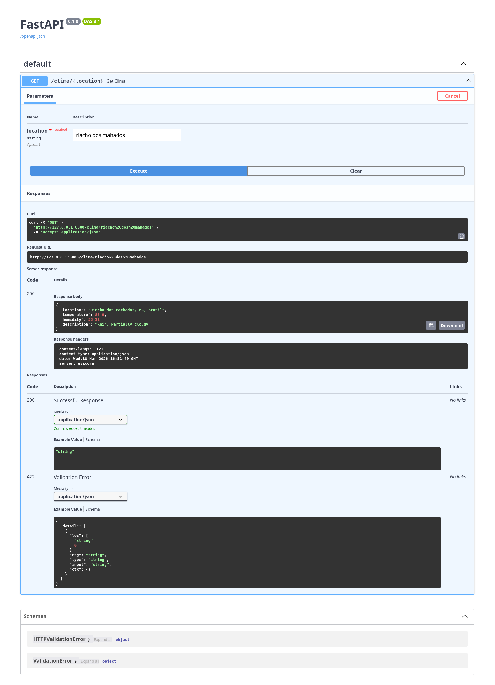

# API de clima 

API para estudo com base na [documentacao](https://roadmap-sh.translate.goog/backend/project-ideas?_x_tr_sl=en&_x_tr_tl=pt&_x_tr_hl=pt&_x_tr_pto=tc#1-personal-blogging-platform-api), item 3. 

### Execução do projeto 
Siga as instruções do Makefile na ordem preestabelecida. Após executar o projeto, acesse o Swagger em http://127.0.0.1:8000/docs, conforme indicado no terminal. Em seguida, será exibida uma tela semelhante a esta:

> [!WARNING]
> Caso queira rodar o projeto localmente voce tambem precisara da `api_key` pra isso voce pode acessar a [documentacao](https://www.visualcrossing.com/weather-api/) 
